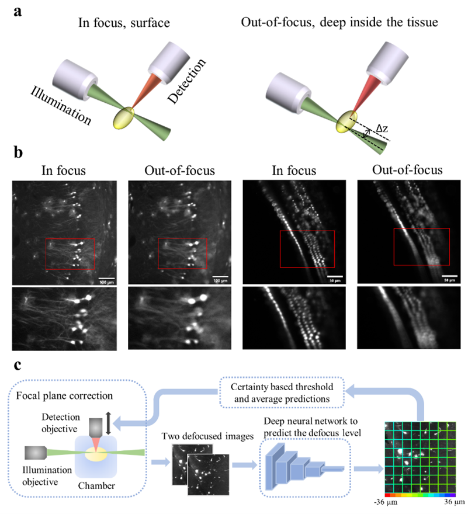

# Deep learning-based autofocus method enhances image quality in light-sheet fluorescence microscopy
a deep learning-based autofocus framework that can estimate the position of the objective-lens focal plane relative to the light-sheet, based on two defocused images.  
Source code for paper (https://doi.org/10.1364/BOE.427099)  
A example dataset is provided for data organization purposes (https://doi.org/10.6084/m9.figshare.18515108)  
## Autofocus pipeline
<!--   -->
  

## Required packages
pytorch, torchvision, matplotlib, numpy, random, skimage, scipy  

## Contact
cli38@ncsu.edu

## References
- Li, Chen, et al. "Deep learning-based autofocus method enhances image quality in light-sheet fluorescence microscopy." Biomedical Optics Express 12.8 (2021): 5214-5226.
- Royer, Loïc A., et al. "Adaptive light-sheet microscopy for long-term, high-resolution imaging in living organisms." Nature biotechnology 34.12 (2016): 1267-1278.
- 

